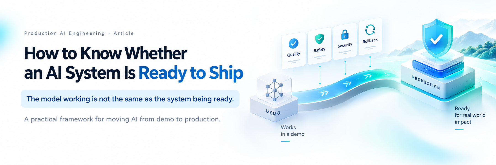

A model working is not the same as an AI system being ready for production.

The more useful release question is not **“Is the model good enough?”** but **“Do we have enough evidence to expose this system to real users, real data and real consequences?”**

Production behavior depends on much more than the foundation model. Prompts, retrieval, tools, permissions, data, interfaces, infrastructure, monitoring and human controls all shape what the system can actually do—and how badly it can fail.

## Readiness is evidence plus control

I use seven evidence gates when thinking about AI release readiness:

- **Task quality** — does the system solve the intended problem under realistic conditions?
- **Robustness** — does it survive variation, noisy context and distribution shift?
- **Safety** — does it remain inside defined behavioral boundaries?
- **Security** — can adversarial inputs, retrieval or tool use bypass controls?
- **Operations** — do latency, cost, reliability and dependencies meet production needs?
- **Governance** — can the team reconstruct what was released, against which evidence and under whose approval?
- **Recovery** — can failures be detected, contained and rolled back quickly?

The key design principle is **blockers first, averages second**. A privacy leak, unauthorized high-impact action, critical safety failure or broken rollback path should stop a release even when aggregate quality scores look excellent.

That leads to a clearer release policy: **Hold** when a critical blocker fails, **Investigate** when important thresholds are missed, and **Ship to Canary** only when required evidence is complete and release conditions pass.

## Shipping is the start of controlled exposure

Passing pre-release evaluation should rarely mean immediate full deployment. It should mean permission to begin a controlled canary with explicit stop conditions, production telemetry and a verified rollback path.

The practical definition is simple: an AI system is ready to ship when its intended behavior is supported by reproducible evidence, unacceptable behavior is constrained by explicit controls, residual risks are understood, and the organization can observe, contain and reverse failures in production.

**Production readiness is not confidence. It is evidence plus control.**

This short post summarizes my full article, **“How to Know Whether an AI System Is Ready to Ship,”** which expands the framework with release contracts, evaluator roles, canary strategy, evidence packs and common release anti-patterns.
