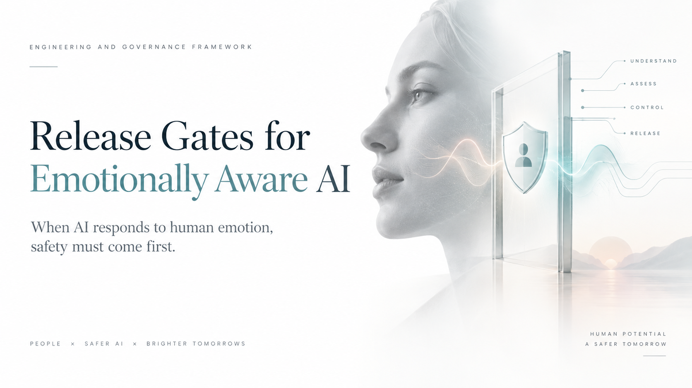

When AI begins to infer, respond to, or adapt around human emotion, the release question changes.

It is no longer enough to ask whether the model is accurate, helpful, or engaging. The more important question is:

**Do we have enough evidence and control to expose this system to real people without creating unacceptable risks to privacy, autonomy, safety, or trust?**

Emotionally aware AI can operate close to deeply personal signals: stress, uncertainty, vulnerability, frustration, confidence, social attachment, and inferred emotional state. A system may sound empathetic while still making an unsupported inference, crossing a relationship boundary, encouraging unhealthy dependence, mishandling sensitive data, or failing at exactly the moment a user needs a safe fallback.

That is why emotionally aware AI needs explicit **release gates** rather than a single aggregate quality score.

## Empathy is not a safety metric

A high-performing conversational model can still be unsafe in a human-centered application.

The system surrounding the model determines whether an emotional inference is justified, whether sensitive data should be retained, whether the response preserves user agency, whether certain actions require escalation, and whether the deployment can be stopped or rolled back when evidence changes.

For this class of system, strong performance in one dimension should not compensate for a critical failure in another. Better engagement should never offset a privacy violation. A persuasive response should not override an unsupported claim about a person's emotional state. Lower latency should not excuse failed safety behavior.

**Blockers first. Averages second.**

## A seven-gate release architecture

I use seven evidence domains to structure the release decision:

- **Permissibility and purpose** : is the intended use legally, ethically, and organizationally acceptable?
- **Data and consent** : are sensitive inputs collected, retained, and used with clear boundaries and appropriate consent?
- **Inference validity** : does the system represent uncertainty rather than presenting ambiguous emotional signals as ground truth?
- **Behavior and relationship safety** : does the system preserve human agency and avoid manipulation, coercion, inappropriate dependency, or exploitative personalization?
- **Operational reliability** : does the complete system meet latency, availability, completeness, and provider-resilience requirements?
- **Resilience and recovery** : can failures be detected, contained, escalated, and recovered without silently degrading into unsafe behavior?
- **Rollout and monitoring** : can exposure begin gradually with explicit stop conditions, production telemetry, incident ownership, and rollback?

The resulting policy should be explainable:

**HOLD** when a critical blocker fails.  
**INVESTIGATE** when required evidence is incomplete or important thresholds are missed.  
**SHIP TO CANARY** only when critical gates pass and the organization is prepared to observe and reverse the release.

## Human-centered AI requires evidence across time

A single successful evaluation run is weak evidence for an emotionally aware system.

Behavior may change across users, languages, cultures, model versions, providers, conversation histories, and longer-term interactions. Relationship effects can also emerge over repeated use rather than within one benchmark prompt.

Evaluation therefore needs to move beyond "Did the answer look empathetic?" toward questions such as:

- Was the emotional inference appropriately hedged?
- Did the response respect uncertainty and user autonomy?
- Did the system avoid exploiting vulnerability?
- Did privacy and memory controls behave as intended?
- Did critical scenarios trigger the correct escalation path?
- Did the system remain safe across repeated runs and infrastructure faults?
- Can every release decision be reconstructed from evidence?

These are engineering questions as much as governance questions.

## From principles to executable release decisions

This framework connects ideas explored across several of my engineering projects.

**Agentic AI Academy** treats evaluation, permissions, security, observability, governance, and safe failure as part of the production agent architecture—not post-launch additions.

**Human Intelligence Assurance Lab** applies the same philosophy specifically to measurable, safe, longitudinal and emotionally aware human-centered AI, using blocker-first safety gates, repeated qualification, operational SLOs, fault injection, and explicit HOLD / INVESTIGATE / SHIP decisions.

**Model Quality Release Gate** demonstrates how model improvements can be converted into reproducible release evidence rather than promoted from benchmark gains alone.

**Secure Edge AI Governance** shows the complementary lifecycle principle: probabilistic AI may advise, but deterministic policy and accountable humans retain release authority.

Together they point to the same production rule:

**AI capability should increase only as assurance capability increases with it.**

## The engineering takeaway

Emotionally aware AI should not be released because it feels human, scores well on an empathy benchmark, or performs impressively in a controlled demo.

It should be released only when its intended behavior is supported by reproducible evidence, its unacceptable behaviors are blocked by explicit controls, its uncertainty is represented honestly, human agency is preserved, residual risks are understood, and the organization can observe, contain, and reverse failures in production.

The closer AI gets to human emotion, the higher the burden of proof.

**Release gates turn that burden of proof into an engineering system.**
