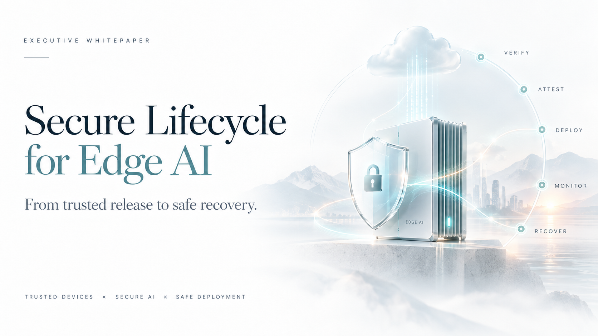

A model can be production-ready while the device is not.

That is one of the central risks in Edge AI. Once AI leaves the cloud and runs across physical devices, industrial systems, vehicles, sensors, or distributed fleets, model quality becomes only one part of the release decision.

The harder question is:

**Can we trust the artifact, device, deployment, runtime state, and recovery path across the full lifecycle?**

## Edge AI is a lifecycle integrity problem

Edge AI has two connected lifecycles.

The **AI lifecycle** governs data, model behavior, evaluation, safety, drift, and performance. The **device lifecycle** governs firmware, identity, secure boot, software provenance, attestation, OTA updates, rollback, vulnerability handling, and end-of-life.

Production trust exists only when these lifecycles are joined.

A strong model benchmark does not prove that a deployment is safe if firmware compatibility is unknown, the artifact cannot be verified, the target device cannot attest its state, rollout cannot be contained, or recovery depends on manual intervention across thousands of devices.

## Eight gates for a secure Edge AI lifecycle

I use eight connected gates to structure the release path:

- **Purpose and risk** — define what the system is allowed to do and the consequences of failure.
- **Provenance** — verify model, firmware, configuration, dependencies, and software-supply-chain evidence.
- **Model and firmware qualification** — evaluate the AI and device stack together under realistic operating conditions.
- **Release authority** — require explicit policy, evidence, and accountable approval before promotion.
- **Device attestation** — verify device identity and trusted state before installation or activation.
- **Staged rollout** — deploy progressively with canaries, stop conditions, and bounded blast radius.
- **Runtime evidence** — monitor health, drift, integrity, latency, failures, and fleet behavior after release.
- **Recovery and end-of-life** — maintain known-good rollback, containment, patching, revocation, and retirement paths.

The core principle is simple:

**The cloud control plane may recommend or orchestrate. A device should execute only artifacts whose identity, integrity, compatibility, policy evidence, and target state have been independently verified.**

## Why current Edge AI deployments fail

Most failures are not caused by a single dramatic model defect. They emerge because the lifecycle around the model is incomplete.

A candidate can improve task accuracy while introducing latency or safety regressions. A signed artifact can still be incompatible with the deployed device state. An OTA update can succeed technically while degrading model behavior in a particular environment. A healthy fleet can become unsafe if drift or compromise is not visible quickly enough.

This is why release engineering matters as much as model engineering.

The production question is not only **“Did the model improve?”** It is also:

- What exactly is being released?
- Who authorized it?
- What evidence supports the decision?
- Which devices are eligible to receive it?
- Can those devices prove their trusted state?
- What happens if the rollout begins to fail?
- How quickly can we contain and reverse it?

## From AI evaluation to fleet governance

This lifecycle discipline appears across several of my engineering projects.

**Agentic AI Academy** treats evaluation, security, observability, governance, and safe failure as first-class production requirements rather than post-launch additions.

**Human Intelligence Assurance Lab** demonstrates why a favorable single run is weak evidence: repeated qualification, operational SLOs, fault injection, and recovery behavior can change the release decision.

**Model Quality Release Gate** converts candidate-model improvements into reproducible evidence and explicit **SHIP / INVESTIGATE / HOLD** decisions instead of promoting models from benchmark gains alone.

**Secure Edge AI Governance** extends the principle to distributed devices: probabilistic AI may advise, but deterministic policy and accountable humans retain release authority, while signatures, attestation, regression evidence, and rollback define the trusted deployment path.

Together they support one production rule:

**Trust must be engineered across the lifecycle—not assumed at deployment time.**

## The engineering takeaway

Secure Edge AI is not just a better MLOps pipeline. It is a governed release, runtime, and recovery system for intelligent artifacts operating across physical infrastructure.

The organizations that scale Edge AI safely will be the ones that can prove artifact integrity, qualify model and firmware combinations, verify target devices, stage releases with bounded risk, observe field behavior, and recover quickly when evidence changes.

**A capable model is not enough. The artifact, device, deployment, and recovery path must be trustworthy too.**
